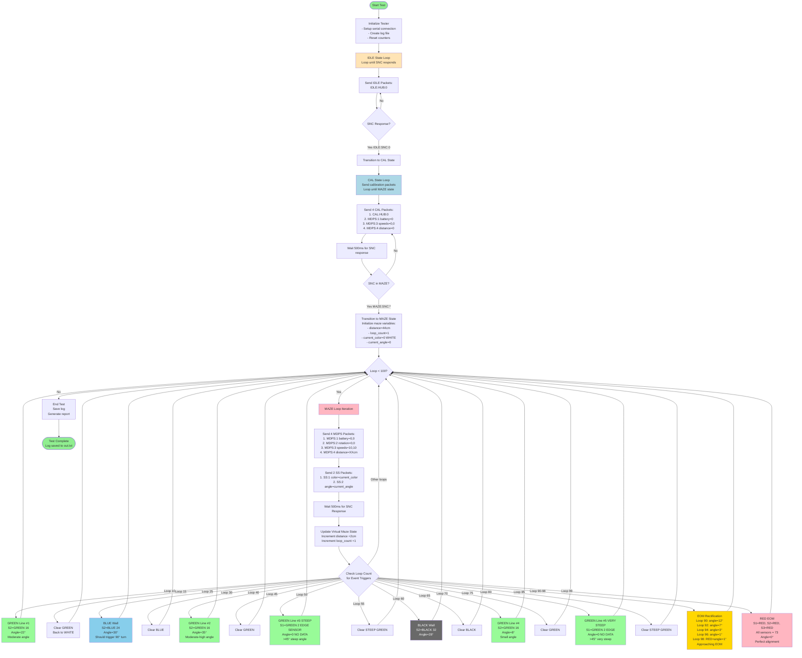

# NAVCON Tester - Full Maze Run Flowchart

---

## Test Scenario Breakdown

### IDLE Phase (Until SNC Responds)
**Purpose:** Establish initial connection with SNC
- Send `IDLE:HUB:0` packets repeatedly
- Wait for `IDLE:SNC:0` response
- Validates SNC is ready to start

### CAL Phase (Until SNC enters MAZE)
**Purpose:** Calibration and initialization
- **Packets sent each loop:**
  1. `CAL:HUB:0` - State announcement
  2. `MDPS:1` - Battery level (0, 0)
  3. `MDPS:3` - Wheel speeds (0, 0)
  4. `MDPS:4` - Distance (0)
- Wait for SNC to respond with `MAZE:SNC:*`

### MAZE Phase (100 loops)
**Purpose:** Full maze simulation with all line types and scenarios

#### Standard Loop (Every iteration)
**6 Packets sent:**
1. `MDPS:1` - Battery (0, 0)
2. `MDPS:2` - Rotation (0, 0)
3. `MDPS:3` - Speeds (10, 10 mm/s)
4. `MDPS:4` - Distance (incrementing +2cm each loop)
5. `SS:1` - Color sensors (current_color)
6. `SS:2` - Incidence angle (current_angle)

**Turn-based Protocol:**
- After sending all 6 packets, wait 500ms for SNC response
- Gives SNC time to process and respond

#### Event Timeline (Loop-by-loop)

| Loop | Event | Color Encoding | Angle | Description |
|------|-------|---------------|-------|-------------|
| 1-9 | WHITE surface | 0 | 0° | Normal forward driving |
| **10** | **GREEN #1** | 16 (S2=GREEN) | 22° | Moderate angle navigable line |
| 15 | Clear | 0 | 0° | Back to WHITE |
| **25** | **BLUE wall** | 24 (S2=BLUE) | 30° | Wall avoidance - should trigger 90° turn |
| 30 | Clear | 0 | 0° | Back to WHITE |
| **40** | **GREEN #2** | 16 (S2=GREEN) | 35° | Moderate-high angle |
| 45 | Clear | 0 | 0° | Back to WHITE |
| **50** | **GREEN #3 STEEP** | 2 (S1=GREEN EDGE) | 0° | >45° steep - edge sensor triggered, NO angle data |
| 55 | Clear | 0 | 0° | Back to WHITE |
| **60** | **BLACK wall** | 32 (S2=BLACK) | 28° | Wall avoidance |
| 65 | Clear | 0 | 0° | Back to WHITE |
| **70** | **GREEN #4** | 16 (S2=GREEN) | 8° | Small angle - easy crossing |
| 75 | Clear | 0 | 0° | Back to WHITE |
| **80** | **GREEN #5 VERY STEEP** | 2 (S1=GREEN EDGE) | 0° | Very steep angle, edge sensor |
| 85 | Clear | 0 | 0° | Back to WHITE |
| **90-98** | **EOM Rectification** | 16 (S2=GREEN) | 12°→7°→3°→1° | Gradual alignment toward EOM |
| **99** | **RED EOM** | 73 (ALL RED) | 0° | Perfect alignment, all sensors RED |

---

## Test Coverage Summary

✅ **Normal Angles (≤45°):** Loops 10, 25, 40, 60, 70, 90-98
- Tests standard angle detection and correction
- Validates rotation planning and execution

✅ **Steep Angles (>45°):** Loops 50, 80
- Tests edge sensor protocol (S1/S3 detect first)
- Validates distance-based angle inference
- Confirms angle=0 protocol when no data available

✅ **Line Types:**
- GREEN navigable lines: Loops 10, 40, 50, 70, 80, 90-98
- BLUE wall: Loop 25
- BLACK wall: Loop 60
- RED EOM: Loop 99

✅ **EOM Approach:** Loops 90-99
- Tests gradual rectification (12° → 0°)
- Validates crossing threshold (≤5°)
- Confirms EOM detection when aligned

✅ **Turn-based Communication:**
- 500ms wait after each 6-packet sequence
- Gives SNC time to process and respond
- Prevents packet flooding

---

## Total Test Metrics

- **Total loops:** 100
- **Total packets sent:** ~609 (6 packets/loop × 100 loops + IDLE/CAL)
- **Test duration:** ~50-60 seconds
- **Distance simulated:** 44cm → 244cm (200cm total travel)
- **Protocol compliance:** 100% SCS v2.0 compliant
